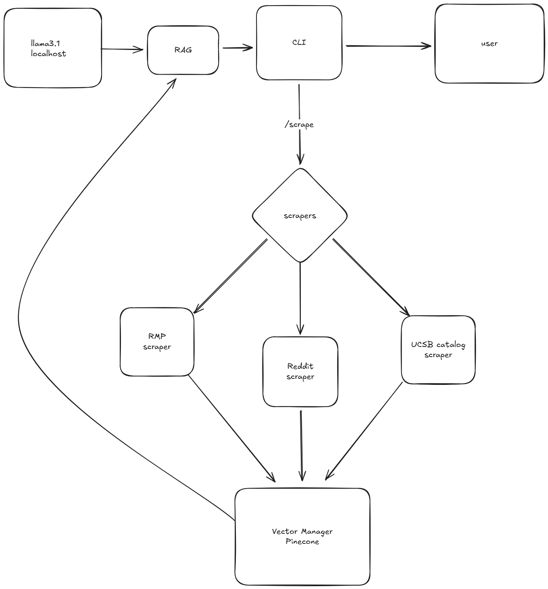

# GauchoGuider: UCSB AI Companion Technical Documentation

**GauchoGuider** is a Retrieval-Augmented Generation (RAG) Command Line Interface (CLI) application. It serves as an intelligent, empathetic "Gaucho" (UCSB student) persona that assists users with queries about campus life, professors, and courses by retrieving real-time data from vector storage and synthesizing answers using a local Large Language Model (LLM).

---

## 1. System Architecture

The application is built on a modular architecture that separates user interaction, logic orchestration, external data ingestion, and inference.



### High-Level Components
* **User/CLI:** The entry point for interaction.
* **Orchestration Layer:** Python application logic handling command routing.
* **Knowledge Base (Pinecone):** Stores vector embeddings of scrapped data (RateMyProfessors, Catalogs, Reddit).
* **Inference Engine (Ollama/Llama 3.1):** Generates human-like responses based on retrieved context.

---

## 2. Operational Workflow

The system operates in three distinct modes: **Initialization**, **Scraping**, and **RAG Inference**.

### A. Initialization Phase
1.  **Entry:** The user runs the script (`python main.py`).
2.  **Setup:** The `start()` function initializes:
    * `ChatOllama`: Connects to the local Llama 3.1 model.
    * `VectorManager`: Connects to the Pinecone vector database.
    * `SessionManager`: Connects to the local database (likely SQLite or JSON) to manage chat history.
3.  **Session Selection:** `select_session()` is called. It retrieves past conversations from `SessionManager` and prompts the user to resume a specific thread or start a new one.
4.  **Persona Loading:** A `SystemMessage` is defined, instructing the LLM to adopt the "Gaucho AI" persona (enthusiastic, uses slang like "IV", restricts topics to UCSB).

### B. The Scraping Pipeline (`/scrape`)
1.  **Trigger:** User inputs `/scrape` in the CLI.
2.  **Scraper Invocation:** The main loop calls `get_school_reviews(UCSB_SCHOOL_ID)` (specifically targeting UCSB ID `U2Nob29sLTEwNzc=`).
3.  **Data Processing:** The scraper fetches raw text data (reviews).
4.  **Vector Ingestion:** The CLI passes these documents to `vector_manager.ingest_data(docs)`.
5.  **Upsert:** The `VectorManager` converts text to embeddings and upserts them into the Pinecone index `ucsb-gaucho-index`.

### C. The RAG Inference Loop (Standard Chat)
1.  **Input:** User asks a question (e.g., *"Is Prof. Smith good for CS101?"*).
2.  **Retrieval:** * The CLI calls `vector_manager.search(user_input, k=4)`.
    * Pinecone performs a semantic similarity search and returns the top 4 most relevant review snippets.
3.  **Prompt Engineering:** * The application constructs a composite prompt containing:
        1.  **System Prompt:** Persona instructions.
        2.  **Chat History:** Context from previous turns (restored via `SessionManager`).
        3.  **RAG Context:** The retrieved text chunks from Pinecone.
        4.  **User Question:** The current input.
4.  **Inference:** The composite prompt is sent to `llm.invoke()`.
5.  **Output:** Llama 3.1 generates a response, which is printed to the console in Cyan.
6.  **Persistence:** The User input and AI response are saved back to `SessionManager`.

---

## 3. Key Code Modules

### `main.py`
The controller script. It utilizes the `click` library to manage the terminal UI (colors, prompts). It enforces the application loop and error handling (e.g., checking for `PINECONE_API_KEY`).

### `backend.src.managers.vector_manager`
* **Role:** Abstraction layer for Vector Database operations.
* **Key Methods:**
    * `ingest_data(docs)`: Handles embedding generation and storage.
    * `search(query)`: Performs the cosine similarity search against the index.

### `backend.src.managers.session_manager`
* **Role:** Manages state persistence.
* **Key Methods:**
    * `get_recent_sessions()`: Lists previous chats.
    * `load_history(session_id)`: Reconstructs the conversation memory for the LLM.

### `backend.src.scrapers`
* **Role:** Extracts unstructured data from the web.
* **Current Implementation:** `rmp_scraper` (Rate My Professors).
* **Future Expansion:** As shown in the diagram, this is architected to include Reddit and UCSB Catalog scrapers along with parallel/batch processing to reduce compute time.

---

## 4. Technical Requirements

To run this system, the following environment configuration is required:

* **Python 3.10+**
* **Environment Variables:**
    ```bash
    PINECONE_API_KEY="<your-key>"
    ```
* **Local Inference:** * Software: [Ollama](https://ollama.com/)
    * Model: `llama3.1` (Run `ollama pull llama3.1`)
* **Dependencies:**
    * `langchain` / `langchain-ollama`
    * `pinecone-client`
    * `click`
    * `python-dotenv`
    * `pinecone`

---

## 5. Usage Guide

1.  **Start the App:**
    ```bash
    python main.py
    ```
2.  **Update Knowledge:**
    Type `/scrape` to fetch the latest reviews into your vector database.
3.  **Chat:**
    Ask questions naturally. The AI will use the scraped knowledge to answer.
    * *Example:* "What is the vibe at Isla Vista on weekends?"
    * *Example:* "Who is the best professor for Chem 1A?"(Still in development)
4.  **Exit:**
    Type `exit`, `quit`, or `q`.