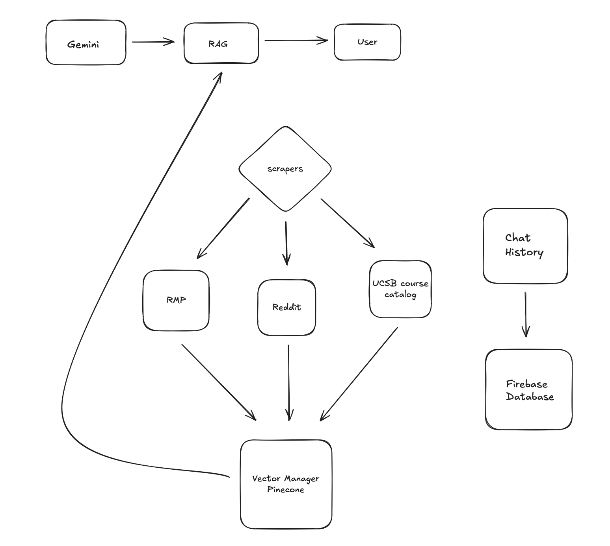

# GauchoGuider Design Document

## System Architecture Overview

The GauchoGuider system is organized into three main subsystems:

1. User Query & Response Pipeline (RAG)
2. Data Ingestion and Indexing Pipeline
3. Chat History Persistence Layer

Below is the high-level architecture diagram:

*(Place your diagram image in `/docs/architecture.png` or update the path if needed.)*

---

### Query & Response Flow (RAG)

1. A user submits a question through the web app or GOLDLens extension.
2. The query is converted into a vector embedding using the **Gemini embedding model**.
3. The embedding is used to perform a similarity search in **Pinecone**.
4. Relevant document chunks (courses, reviews, discussions) are retrieved.
5. The retrieved context and original query are sent to the language model.
6. The model generates a grounded response and returns it to the user.

This Retrieval-Augmented Generation (RAG) approach ensures responses are based on real UCSB data rather than relying only on model knowledge.

---

### Data Ingestion Pipeline

The knowledge base stored in Pinecone is built through a separate `/scrape` workflow.

Data sources:
- RateMyProfessor (RMP)
- Reddit
- UCSB Course Catalog API

Processing steps:
1. Scrape raw data
2. Normalize into a unified format
3. Split into smaller chunks
4. Generate embeddings using Gemini
5. Store vectors in **Pinecone** via the vector manager

Preprocessing and indexing data ahead of time reduces query latency and ensures consistent formatting across sources.

---

### Chat History Persistence

Conversation history is stored separately in **Firebase**.

Each interaction is saved per user to:
- Restore previous conversations
- Support multi-turn context
- Allow long-term course planning sessions

This separation keeps:
- **Pinecone** → academic knowledge
- **Firebase** → user state

This allows each system to scale independently.

---

## Key Design Decisions

### Separate Storage Systems

We needed to support two different types of data:

- Semantic knowledge for retrieval → **Pinecone**
- User conversations and session state → **Firebase**

This separation allows each system to be optimized for its specific workload and keeps user data isolated from academic content.

---

### Consistent Embedding Strategy

We use the same **Gemini embedding model** for:
- Scraped documents
- User queries

This ensures all vectors exist in the same semantic space and improves retrieval accuracy.

---

### Unified Scrape Pipeline

Instead of querying external sources at runtime, we aggregate data into a single normalized format and index it ahead of time.

Benefits:
- Faster response times
- Consistent chunking and preprocessing
- Controlled refresh schedule

---

### GOLDLens Integration

The team decided to integrate GauchoGuider into a Chrome extension for UCSB GOLD.

This decision shifted the product from a standalone tool to a contextual assistant available during course selection. The backend APIs were designed to support both the web app and the extension.

---

### Branding and UI Identity

The team created a distinct visual identity to make the system approachable and recognizable. Design decisions around color, typography, and layout were made to ensure consistency across the web interface and extension.

All major decisions were discussed during team meetings and documented in GitHub meeting logs, where tradeoffs between simplicity, scalability, performance, and usability were evaluated.

---

## User Experience (UX)

### Design Goals

- Allow natural-language course exploration
- Provide fast, readable answers
- Support ongoing, multi-session planning

The primary experience is the standalone web application, with GOLDLens as a secondary entry point.

---

### High-Level User Flow

1. User opens GauchoGuider
2. Starts a new or existing chat session
3. Asks a question (course difficulty, professor quality, recommendations, etc.)
4. The system returns a structured, easy-to-scan response
5. The user refines their question with follow-ups
6. Conversation history is saved in Firebase

This conversational model allows users to refine decisions over time instead of repeatedly searching multiple websites.

---

### Information Presentation

The interface is designed to prioritize clarity and scannability:

- Clean, single-focus layout
- Emphasis on conversation history
- Responses formatted for quick understanding
- Persistent sessions for long-term planning

The GOLDLens extension provides contextual access while browsing courses, but the web app supports the primary workflow.

---

## Future UX Considerations

- Improve response latency
- Expand data coverage from Reddit and RateMyProfessor
- Surface source transparency for retrieved information
- Add course comparison and planning features
